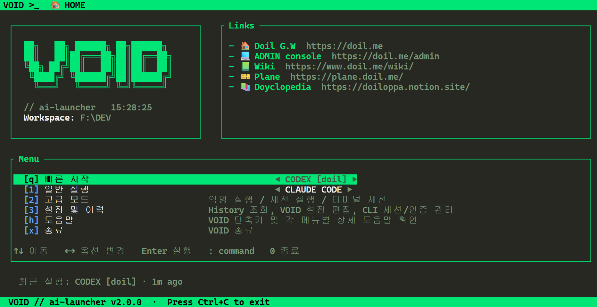

# VOID//ai-launcher

AI CLI 도구(Claude Code, Codex, agy 등)를 대화형 TUI 메뉴로 실행하는 Node.js 런처입니다.
일반 실행, 익명 모드(격리된 임시 `$HOME`), 네임드 세션(`CLAUDE_CONFIG_DIR` / `CODEX_HOME`
분리)을 지원합니다.




## Requirements

- **Node.js 18 이상 — 반드시 사전에 설치되어 있어야 합니다.**
`cmd_generator.js`(설치 스크립트)와 `launcher.js` 자체가 Node 런타임으로 실행되는
스크립트라서, 설치 스크립트를 돌리는 시점에 이미 Node가 있어야 합니다. Node를 설치해
주는 부트스트랩 과정은 없습니다.
  - [nodejs.org](https://nodejs.org)에서 LTS 버전 설치, 또는 `nvm`/`brew install node` 등
  사용 중인 버전 관리자로 설치하세요.
  - 확인: `node -v` (v18.x 이상이어야 함)
- **Linux**: 추가 설치 없이 바로 사용 가능. 풀스크린 wrapper(멀티탭, border/status bar)를
쓰려면 `tmux`가 필요합니다 — 없어도 크래시 없이 더 단순한 실행 경로로 자동 폴백됩니다.
- **macOS**: Big Sur 이후 tmux가 기본 미포함이라 설치 스크립트가 `brew install tmux`를
자동으로 실행합니다. Xcode Command Line Tools가 없거나(또는 macOS 업데이트 후 흔히
깨지는 경우) brew install이 실패하면, 설치 스크립트가 이를 감지해 재설치를 안내/진행합니다.
tmux가 끝내 없어도 크래시 없이 더 단순한 실행 경로로 자동 폴백됩니다.
- **Windows**: 네이티브 지원. 풀스크린 wrapper는 [tmux-windows](https://github.com/arndawg/tmux-windows)
(winget 우선, 실패 시 서브모듈에 pin된 릴리즈에서 `tmux.exe` 자동 다운로드)를 사용합니다.
tmux-windows 확보에 실패해도 `@xterm/headless` 기반 자체 컴포지터로 자동 폴백되어
border/status bar가 있는 풀스크린 경험을 유지합니다(멀티탭/세션 detach-reattach는 현재
tmux-windows 경로에서만 지원).

## Install

```bash
git clone https://github.com/D0iloppa/void-ai-launcher.git
cd void-ai-launcher
```

Windows에서 tmux-windows를 서브모듈 릴리즈 바이너리로 직접 빌드/사용하려면 대신
`git clone --recurse-submodules https://github.com/D0iloppa/void-ai-launcher.git`로
clone하세요(winget으로 자동 설치되면 이 단계는 불필요합니다).

OS별 설치 스크립트를 실행하세요. Node.js가 없으면 스크립트가 먼저 설치를 시도한 뒤
`cmd_generator.js`(의존성 설치 + `void` 전역 명령 등록)를 호출합니다.


| OS                   | 명령                      |
| -------------------- | ----------------------- |
| macOS / Linux        | `./scripts/install.sh`  |
| Windows (PowerShell) | `./scripts/install.ps1` |
| Windows (cmd.exe)    | `scripts\install.cmd`   |


Node.js가 이미 설치돼 있다면 `npm run build`(= `cmd_generator.js` 직접 호출)로도 동일하게
설치할 수 있습니다.

## Usage

```bash
void                       # 대화형 메인 메뉴
void --help                # 도움말
void <tool> [args...]      # 예: void claude, void codex exec "..."
void <tool> --anon         # 익명 모드 (임시 $HOME)
void host                  # 호스트 셸 실행
void prompt                # Anthropic/OpenAI/Google 프롬프트 모드
void tokens                # API 토큰 관리
void sessions              # 네임드 세션 관리
```

## Configuration

`config.yml`에서 도구 목록·테마·설정을 관리합니다. 새 AI 도구를 추가할 때 편집하는 유일한
파일입니다.

## Development

```bash
npm run check      # 전체 JS 파일 문법 검사 (node --check)
```

자세한 아키텍처 설명은 `CLAUDE.md`를 참고하세요.